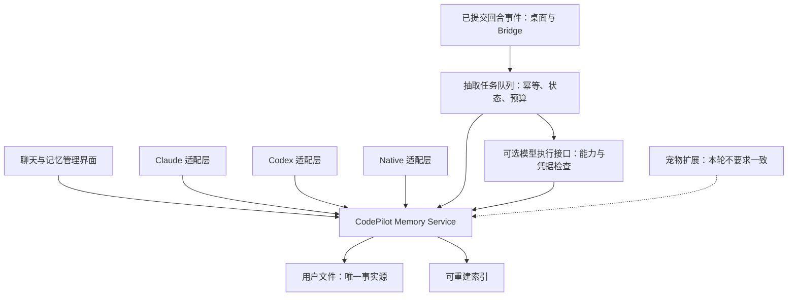

# 辅助调用故障原因与 Runtime 无关记忆方案

> **实施跟进**：用户随后已授权修复，工作区实现与验证见 [Memory Runtime 解耦执行计划](../exec-plans/active/memory-runtime-decoupling.md)。本文中的“尚未修改/待修”和源码行号描述调研时的 v0.67.16 基线；离线旧行为探针须在该基线运行，不代表修复后的预期结果。线上统计仍为文中指定时间的快照。

> 2026-09-21；状态：原因分析与方案报告，本调研未修改产品或线上配置；已按用户提供的无 blocker 审查补充证据边界。
> 用户补充要求：记忆与 Runtime 解耦，Claude Code / Codex / Native 不能出现能力不兼容；宠物不纳入本轮一致性要求。

## 1. 结论

当前问题不是单纯“记忆引擎不够智能”，而是四层职责没有分清：谁拥有记忆、谁决定作用域、谁执行可选模型任务、谁负责向 Runtime 暴露工具。存储虽已有共享文件，工具实现和辅助调用仍存在分叉。

Sentry 已证实的额度成因是**持续接收旧入口事件 + 当前辅助功能反复失败 + 错误分类/跨请求预算不完善**。其中发现一条与高频组安全样本高度吻合、可以隔离复现的凭据能力错配链。线上已保存事件移除了原始错误类型与 cause，不能把所有 unknown 都归成这一种原因。

建议把记忆定义为 CodePilot 自身服务：共享存储、来源、检索、写入、删除、权限、预算和生命周期；Runtime 只做调用与上下文投递适配。可选的模型抽取/重排也不应被强制绑定到 Anthropic 或 Native SDK。宠物是独立消费者，可后续接入，不决定基础记忆是否可用。

## 2. Sentry 高频错误：原因链与证据边界

### 2.1 已定位的凭据能力错配

生产链路：

1. `memory-extractor.ts:89-103`、quick-actions 和 MCP rerank 另行 `resolveProvider({ callScene, useCase: 'small' })`，不沿用主聊天的 Runtime/会话 Provider/model。辅助模型与聊天模型分开并非天然错误，但执行能力必须被显式验证。
2. `provider-resolver.ts:1132-1143` 把 Claude 配置文件中的凭据也算作 `hasCredentials=true`。这原本为 Claude Agent SDK 子进程通过 `settingSources` 读用户配置服务。
3. 辅助调用使用 `text-generator → createModel → toAiSdkConfig → AI SDK`。`provider-resolver.ts:830-846` 的 Env Anthropic 鉴权只取进程环境和旧 DB 设置，并没有把 Claude 配置文件中的 key/token/base URL 交给该执行路径。
4. 因而“凭据只配置在 Claude settings”时：检测认为可用，但执行器拿不到凭据；仅在配置文件里的代理地址也没有被这一层消费。`ai-provider.ts:82-101` 已有“settings.json 有凭据但 Native 不能读取”的专用提示，却位于 `if (!resolved.hasCredentials)` 内；resolver 在 settings-only 场景恰好返回 true，所以正常解析链下该提示分支不可达。两处代码对“可用”的定义相互矛盾：修复需区分“Claude SDK 子进程可用”与“AI SDK transport 可用”，不能继续只用一个布尔值。这里不能通过绕过权限、悄悄切账号或强行读取所有 CLI 凭据来补洞。
5. AI SDK 在流开始时抛 `AI_LoadAPIKeyError`，`pumpTextStream` 在 `text-generator.ts:51` 包装成 Error 并保留 cause。错误分类器未识别这一 SDK 错误类型，而且其固定文案是 `API key is missing`，不匹配当前主要识别 `missing API key` 的规则。
6. `memory-extractor.ts:91` 的 `if (!resolved.hasCredentials) return` 同样因误判为 true 而不生效，调用会继续进入 generateText 并抛错，最终归为 `unknown`、进入 `provider.unknown_failure` 上报路径。外层提取/重排捕获失败并降级，不能取消共享 catch 已安排的异步上报；下次触发可再次计数。这里证明的是前置门禁失效，不代表所有辅助入口都没有冷却机制。

**隔离验证结果**：使用生产 resolver、model factory、text-generator、normalizer 与当前安装的真实 AI SDK，三个 callScene 均复现 `hasCredentials=true → transportHasKey=false → AI_LoadAPIKeyError → unknown/shouldReport=true`，`fetchCalls=0`。仅 mock 了 DB/配置、settings 凭据存在性和遥测发射，未读取真实凭据，也未做真实 Claude 主聊天 smoke。相关文件与 `v0.67.16` 比对无差异，证明缺陷存在于正式版本。完整方法和脚本见文末。

线上关联证据（**2026-09-21 约 12:30，Asia/Shanghai 快照**，来源及查询口径见 [Sentry 额度调查](sentry-quota-audit-2026-09-21.md)，不能用文末离线探针复核线上计数）：该快照中 DESKTOP-20/21/23 的最新样本均为 `environment / anthropic / status none`，栈落在 `pumpTextStream:51`；场景分别为自动提取、快捷建议、记忆重排。查询截止 2026-09-21 04:30 UTC 的近 30 天事件合计 2,056 条，但这个数字不是本凭据缺陷的已证明发生次数，也不是实时值。标签 `runtime.id=codepilot_runtime` 是辅助 reporting boundary 写死的，不表示用户主聊天一定选了 Native；`environment` 也不能推断请求实际连了官方 Anthropic。

### 2.2 为什么“同一个问题”能耗费很多条额度

- 新旧项目共用组织额度，旧项目仍接收已安装旧包以及混有其他 release 名称的事件；保留项目历史本身不耗新额度，继续 ingestion 才耗。
- 自动提取按轮次再次触发，辅助建议虽有局部冷却，但没有统一的“当前凭据能力不可执行→停止重复尝试”状态。
- fingerprint 把相似错误归到一个 Issue，不等于只计一次。现有 marker 抑制同一个异常对象被重复捕获，不能合并多个独立请求。
- `tracesSampleRate=0` 不采样 errors；当前无统一跨请求 error 预算。
- 9/13–9/18 的超额已有统计证据，9/18 重置；533/5000 是 **2026-09-21 约 12:30（Asia/Shanghai）的账单快照**，不是实时值。

详见 [额度、窗口和版本拆分](sentry-quota-audit-2026-09-21.md)。

### 2.3 为什么目前还不能精确解释每个 unknown

`createSafeTelemetryError` 有意替换原文、删除原始 cause/code/type，保留安全 stack；sanitizer 只接受有限字段。这保护用户数据，但未补足可诊断的低基数类别：缺凭据、连接断开、响应校验等不同原因可呈现相同包装栈和标题。

本轮直接调用生产 normalizer 的合成对照：ECONNRESET、ECONNREFUSED、EPIPE、UND_ERR_SOCKET 均归 unknown；ENOTFOUND、ETIMEDOUT 能正确归为 transient；INVALID_API_KEY 能归为 user_action_required。说明 unknown 还可能包含网络故障，不应全部当配置错或全部静默过滤。

建议增加**固定枚举**的失败阶段、SDK 错误族、credential source/capability、transport 类别及 callScene tag；禁止补传原始 prompt、token、URL、Provider body 或整个 cause。先修分类与执行可用性，再有选择地做失败冷却和事件预算，保留真实产品异常。

## 3. 记忆问题的具体根因

| 问题 | 根因 | 证据与影响 |
|---|---|---|
| 正文有内容却搜不到 | 先按标题/标签/路径分数筛掉候选，正文匹配发生得太晚 | 合成 notes.md 正文含 cerulean：正文查询空，标题查询命中；见 #97 |
| Native 可读预期目录外的同前缀目录 | 用字符串 startsWith 代替目录边界与 realpath 检查 | work → ../work-other/synthetic.txt 已复现；工具属于 safe_read，不会靠审批弥补；见 #96 |
| 换 Runtime 后行为不同 | Native 维护自己的 memory-search，Claude/Codex 复用另一套 MCP 业务实现 | Native 无 MCP 的时间衰减/可选重排，行号、读取预算、格式、挂载条件不同 |
| 只读过记忆也抑制自动提取 | 用整个序列化响应中是否出现 tool_use/tool_result 与 memory 路径判断“已经写过” | 只读 Read(memory.md)、Write 返回 is_error:true 均被当已写入；已直接调用生产函数复现 |
| 失败/中断回合也可能触发提取 | collector 的抽取分支位于 finally，未对齐标题生成的终态成功、owner 与持久化门禁 | 源码已确认触发条件缺失；尚未完成真实取消/并发回合写入 smoke，不能声称已观察到用户错误记忆 |
| 桌面和 Bridge 自动记忆不一致 | 桌面三 Runtime 共用 collector；Bridge 另走 consumeStream，未接同一抽取入口 | 不是“Codex 天生不能抽取”；应统一入口事件，不能分别往每个 Runtime 补回调 |
| 偏好变更后两条记忆冲突 | 自动抽取直接追加 Markdown 列表，缺少来源身份、幂等、替代/撤销关系 | 换引擎或添加向量库不会自行解决“哪个事实当前有效” |
| 项目/助理作用域混淆 | 多处靠 cwd 等于 assistant path 激活，Native 又按非空 cwd 挂载 | 应按明确绑定和授权 scope 解析，而非由 Runtime 或路径字符串暗中决定 |

本地探针与原始源码位置见 [基础记忆调查](memory-products-codepilot-2026-09-21.md)。上述问题尚未修复；“成功调用过搜索函数”不能作为跨 Runtime 功能一致的验收。

## 4. Runtime 无关的目标边界

### 4.1 数据与核心服务只有一份



- **Memory Service 不依赖 Claude Agent SDK、Codex app-server 或 AI SDK 的工具类型。** 提供中立请求/结果；当前 memory-search-mcp.ts 中的检索、读取、排序与预算逻辑需下沉，不能直接把 Claude MCP factory 命名为“共享核心”。
- **共享 scope 与事实源。** 同一 workspace/assistant/global 绑定对应同一数据、版本与索引；runtimeId 只作为来源记录，不用它分出三份用户记忆。保留 Markdown 可读可编辑；SQLite 可做索引，但不成为唯一副本。用户直接编辑文件后索引能重建。
- **共享读写生命周期。** search/get/recent，以及后续记住/更正/忘记调用同一规则。写操作由单一写入协调者处理、带 source/operation ID、原子更新与撤销传播；权限在服务入口复核，不能依赖某个 Runtime 是否弹了确认框。
- **成功回合的统一事实事件。** 桌面与 Bridge 将已经持久化且符合终态/owner 条件的回合提交一次。抽取任务以 source turn/message ID 幂等，失败、取消、接管后的旧回合不能凭 finally 就写新记忆；手动“记住”可有独立明确命令路径。
- **用真实写入回执去重。** 只读、失败写入、模型声称“已记住”不算保存成功；Runtime 原生文件工具需要通过成功结果及文件变更证据归一化，不能扫描字符串猜测。
- **显式作用域不等于隐藏用户文件。** 不激活 Assistant 自动服务的项目，仍可通过普通文件工具访问用户明确授权的目录；遵守已有 Harness Home binding 边界。

### 4.2 Runtime 只承担薄适配

| 层 | 允许不同 | 必须一致 |
|---|---|---|
| 工具传输 | Claude 进程内 MCP、Codex HTTP MCP、Native tool execute | 参数语义、scope、权限、数据、状态与错误码 |
| 上下文投递 | system/developer instructions 的具体位置 | 同一 source generation 与有效记忆，预算截断可追溯 |
| 展示封装 | MCP content 与 Native tool result 载体 | 来源引用、排序规则、行号、读取边界、长度限制 |
| 模型行为 | 模型是否自主调用工具、最终回答措辞 | 基础工具实际可用；记忆核心不因选某 Runtime 消失 |

一致性不意味着不同模型一定逐字给出相同回答，而是相同输入、scope、数据版本和配置下，服务返回相同语义结果。必需的“最近记忆”可由宿主确定性装载，避免只靠提示词要求某模型第一轮自行调用。

现有 Runtime 会话 owner 规则仍保留。共享记忆不要求把 Claude/Codex 的原生会话状态强行互转，也不自动解锁已有会话的 Runtime 切换。

### 4.3 基础记忆与模型增强分开

- 文件保存、关键词检索、读取、更正/忘记、来源回查，不需要额外模型请求；断网或没有辅助模型凭据时仍可用。
- 自动抽取、语义检索或 AI 重排是可选增强。由统一执行接口根据明确配置选择**真正能使用相应凭据且场景获准**的后端；不能仅看全局 `hasCredentials`。
- 不应要求 Codex 用户为了基础记忆额外配置 Anthropic。若 CLI/OAuth 凭据只能通过特定执行器使用，应走经验证、获准的对应适配；尚无可执行后端时，保留基础能力并明确任务 pending/unavailable，而不是偷偷切 Provider 或把跳过写成“已记住”。
- 受限套餐的后台调用策略继续遵守 provider-call-policy；Runtime 解耦不构成扩大账号使用授权。重排不可用时，各 Runtime 使用相同确定性排序降级，不让 Native 缺功能、Claude 额外失败。
- 宠物稀有度、性格、里程碑不纳入本轮兼容矩阵；是否保留其频率偏好可后续决策，但不应改变基础记忆的存储、权限和可用性。此要求不是删除或禁用已有宠物。

## 5. 修复顺序与验收建议

本节只是顺序建议，不作为实施执行计划。#99 涉及三个以上模块；动工前须按 [CLAUDE.md](../../CLAUDE.md) 与 [执行计划规范](../exec-plans/README.md)，将实施范围、分阶段验收和 Smoke Ledger 整理到 `docs/exec-plans/active/`，并在此保留研究依据与计划链接。

1. **先修确定性缺陷**：凭据能力检查与辅助执行器一致；识别 LoadAPIKeyError 等结构化错误；正文候选召回；Native 目录边界。分类修复不能代替辅助功能恢复，否则只是让 Sentry 安静。
2. **提取共享 Memory Core，保留旧数据**：先把现有读/搜索/recent 行为统一到无 Runtime 依赖的核心，再替换两个外壳，保持工具名与历史文件兼容；不同时更换存储引擎。
3. **统一回合、写入与抽取生命周期**：成功持久化事件、显式绑定、幂等任务、真实写入回执、失败冷却；覆盖 Bridge。给自动任务可见状态，避免静默丢记忆。
4. **补来源、更正/遗忘产品界面**：同一事实来源、替代关系、删除传播与重建不复活；再用本地评估集决定是否引入向量或图关系。

验收必须使用同一批 fixture 跑 Claude / Codex / Native 适配，分别证明：正文唯一命中、相同行号和排序、同前缀兄弟路径/symlink 拒绝、无凭据基础记忆可用、只读和失败写入不误跳过、取消/接管/持久化失败不重复保存、Bridge 与桌面一致、跨 Runtime 新会话能读取已保存的事实、更正后旧值不作为当前事实、删除后重建不复活。再分别做真实 Provider/客户端 smoke；单元测试和源码矩阵不能替代工具成功挂载和实际调用。

任务入口还应显式区分用户聊天、Bridge、headless 与 heartbeat。系统自发内容默认不自动提取，不能为一致性简单对所有后台回合开记忆。

已确认缺陷和生命周期/解耦工作分别记录到 [技术债 #96–99](../exec-plans/tech-debt-tracker.md)。

本轮只做报告、离线复核与技术债登记。尚未改产品、提交、发版、停用 Sentry 入口或启动自动监控。

## 验证方法与可复核边界

以下探针不访问真实 DB、Claude 文件或真实 Provider，不读取凭据值。它把生产 TS 源码转为临时 CJS 后载入 VM；mock 边界包括 DB/config 读取、Claude settings 布尔值、遥测发射、Provider policy 与合成单项 Haiku catalog，实际 resolver、model factory、text-generator、pump、normalizer 和已安装 AI SDK 都执行。Provider policy 被 mock 为 no-op：真实 policy 在 scene 已提供且 provider=undefined 时允许该 env fixture，但该 mock 也跳过了 `CALL_SCENE_REQUIRED` 校验；三个 generateText 场景均显式传入合法 scene，因此不影响本次凭据错配结论，探针不构成 scene 必填或套餐策略的测试。global fetch 被换成必抛函数并计数。源码转译会移动栈行号，探针显示 pump 第 41 行对应真实 TS 第 51 行，不应把转译行号写入源码评审。

完整 stdout、完整脚本内嵌如下，持久化本报告即可保留复核依据。SDK stderr 仅重复三次 LoadAPIKeyError，不含凭据，另存 `/tmp/codepilot-provider-probe-sdk-stderr.log`。

### 完整 stdout

```jsonl
{"scene":"automatic_memory_extract","hasCredentials":true,"providerClass":"environment","protocol":"anthropic","transportHasKey":false,"errorName":"AI_LoadAPIKeyError","message":"Anthropic API key is missing. Pass it using the 'apiKey' parameter or the ANTHROPIC_API_KEY environment variable.","stackSite":"at pumpTextStream (/Users/op7418/Documents/code/opus-4.6-test/src/lib/text-generator.ts:41:29)","classification":{"category":"PROVIDER_FAILURE","outcome":"unknown","rootCause":"other","retryExhausted":true,"shouldReport":true}}
{"scene":"automatic_quick_actions","hasCredentials":true,"providerClass":"environment","protocol":"anthropic","transportHasKey":false,"errorName":"AI_LoadAPIKeyError","message":"Anthropic API key is missing. Pass it using the 'apiKey' parameter or the ANTHROPIC_API_KEY environment variable.","stackSite":"at pumpTextStream (/Users/op7418/Documents/code/opus-4.6-test/src/lib/text-generator.ts:41:29)","classification":{"category":"PROVIDER_FAILURE","outcome":"unknown","rootCause":"other","retryExhausted":true,"shouldReport":true}}
{"scene":"active_turn_memory_rerank","hasCredentials":true,"providerClass":"environment","protocol":"anthropic","transportHasKey":false,"errorName":"AI_LoadAPIKeyError","message":"Anthropic API key is missing. Pass it using the 'apiKey' parameter or the ANTHROPIC_API_KEY environment variable.","stackSite":"at pumpTextStream (/Users/op7418/Documents/code/opus-4.6-test/src/lib/text-generator.ts:41:29)","classification":{"category":"PROVIDER_FAILURE","outcome":"unknown","rootCause":"other","retryExhausted":true,"shouldReport":true}}
{"settingsAbsentHasCredentials":false,"fetchCalls":0,"captured":3}
{"probe":"retry503","result":{"category":"PROVIDER_HTTP_5XX","outcome":"transient_upstream","rootCause":"http_5xx","statusCode":503,"retryExhausted":true,"shouldReport":true}}
{"probe":"retry401","result":{"category":"PROVIDER_HTTP_4XX","outcome":"user_action_required","rootCause":"http_4xx","statusCode":401,"retryExhausted":true,"shouldReport":false}}
{"probe":"fetchReset","result":{"category":"PROVIDER_FAILURE","outcome":"unknown","rootCause":"other","retryExhausted":true,"shouldReport":true}}
{"probe":"noOutput","result":{"category":"EMPTY_RESPONSE","outcome":"provider_protocol_fault","rootCause":"no_output","retryExhausted":true,"shouldReport":true}}
{"probe":"dns","result":{"category":"PROVIDER_DNS_FAILURE","outcome":"transient_upstream","rootCause":"dns","retryExhausted":true,"shouldReport":true}}
```

### 完整离线探针

保存为任意 `.cjs` 文件后运行 `node /path/probe.cjs`。如仓库位置不同，仅调整 root 常量。

```js
const fs = require('node:fs');
const vm = require('node:vm');
const {createRequire} = require('node:module');
const assert = require('node:assert/strict');
const root='/Users/op7418/Documents/code/opus-4.6-test';
const req=createRequire(root+'/package.json');
const ts=req('typescript');
delete process.env.ANTHROPIC_API_KEY;
delete process.env.ANTHROPIC_AUTH_TOKEN;
delete process.env.ANTHROPIC_BASE_URL;
process.env.NODE_ENV='production';
let fetchCalls=0;
globalThis.fetch=async()=>{fetchCalls++;throw new Error('NETWORK_DISABLED_IN_PROBE')};
function load(rel, mocks) {
 const module={exports:{}};
 const source=ts.transpileModule(fs.readFileSync(root+'/'+rel,'utf8'),{compilerOptions:{module:ts.ModuleKind.CommonJS,target:ts.ScriptTarget.ES2022}}).outputText;
 const localRequire=(name)=> {
  if (Object.hasOwn(mocks,name)) return mocks[name];
  if (name.startsWith('@ai-sdk/')||name==='ai') return req(name);
  return new Proxy({}, {get:(_,key)=> { if(key==='__esModule') return true; return (...args)=>{throw new Error('UNEXPECTED_MOCK_CALL '+name+'.'+String(key));};}});
 };
 vm.runInThisContext('(function(require,module,exports,process){'+source+'\n})',{filename:root+'/'+rel})(localRequire,module,module.exports,process);
 return module.exports;
}
let settingsOnly=true;
const catalog={ENV_CLAUDE_CODE_MODELS:[{modelId:'haiku',upstreamModelId:'claude-haiku-4-5-20251001'}]};
const db={getDefaultProviderId:()=>undefined,getActiveProvider:()=>undefined,getSetting:()=>undefined};
const claude={hasClaudeSettingsCredentials:()=>settingsOnly};
const policy={assertProviderCallAllowed:()=>{}};
const resolver=load('src/lib/provider-resolver.ts',{'./db':db,'./provider-catalog':catalog,'./claude-settings':claude,'./provider-call-policy':policy});
const provider=load('src/lib/ai-provider.ts',{'./provider-resolver':resolver,'./claude-settings':claude,'./provider-call-policy':policy,'./tokendance':{isTokenDanceBaseUrl:()=>false}});
const contract=load('src/lib/telemetry/contract.ts',{});
const normalizer=load('src/lib/telemetry/root-cause.ts',{'./contract':contract});
const marker=load('src/lib/telemetry/provider-marker.ts',{});
let captured=[];
const text=load('src/lib/text-generator.ts',{'./ai-provider':provider,'./provider-call-policy':policy,'./telemetry/provider-marker':marker,'./telemetry/provider-failure':{reportProviderFailure:(error,input)=>captured.push({input,error,result:normalizer.normalizeTelemetryFailure('PROVIDER_FAILURE',error,{retryExhausted:true})})}});
(async()=>{
 for (const scene of ['automatic_memory_extract','automatic_quick_actions','active_turn_memory_rerank']) {
  const resolved=resolver.resolveProvider({callScene:scene,useCase:'small'});
  const config=resolver.toAiSdkConfig(resolved,resolved.upstreamModel||resolved.model||'haiku');
  assert.equal(resolved.hasCredentials,true);
  assert.equal(config.apiKey,undefined);assert.equal(config.authToken,undefined);
  try {await text.generateTextFromProvider({callScene:scene,providerId:resolved.provider?.id||'',model:resolved.upstreamModel||resolved.model||'haiku',system:'Synthetic test',prompt:'Synthetic test'});throw new Error('expected failure');}
  catch(error){
   const cap=captured.at(-1);
   assert.equal(error.cause.name,'AI_LoadAPIKeyError');assert.equal(cap.result.outcome,'unknown');assert.equal(cap.result.shouldReport,true);
   console.log(JSON.stringify({scene,hasCredentials:resolved.hasCredentials,providerClass:resolved.provider?'configured':'environment',protocol:resolved.protocol,transportHasKey:!!(config.apiKey||config.authToken),errorName:error.cause.name,message:error.cause.message,stackSite:error.stack.split('\n')[1].trim(),classification:cap.result}));
  }
 }
 settingsOnly=false;
 assert.equal(resolver.resolveProvider({useCase:'small'}).hasCredentials,false);
 console.log(JSON.stringify({settingsAbsentHasCredentials:false,fetchCalls,captured:captured.length}));
 const {APICallError}=req('@ai-sdk/provider');
 const {RetryError}=req('ai');
 const cases={
  retry503:new RetryError({message:'Failed after 3 attempts.',reason:'maxRetriesExceeded',errors:[new APICallError({message:'synthetic',url:'https://example.invalid',requestBodyValues:{},statusCode:503})]}),
  retry401:new RetryError({message:'Failed after 3 attempts.',reason:'errorNotRetryable',errors:[new APICallError({message:'synthetic',url:'https://example.invalid',requestBodyValues:{},statusCode:401})]}),
  fetchReset:Object.assign(new TypeError('fetch failed'),{cause:Object.assign(new Error('read ECONNRESET'),{code:'ECONNRESET'})}),
  noOutput:Object.assign(new Error('No output generated'),{name:'AI_NoOutputGeneratedError'}),
  dns:Object.assign(new TypeError('fetch failed'),{cause:Object.assign(new Error('getaddrinfo ENOTFOUND'),{code:'ENOTFOUND'})}),
 };
 for (const [name,original] of Object.entries(cases)) {
  try{for await (const item of text.pumpTextStream((async function*(){yield {type:'error',error:original};})())){}}
  catch(error){console.log(JSON.stringify({probe:name,result:normalizer.normalizeTelemetryFailure('PROVIDER_FAILURE',error,{retryExhausted:true})}));}
 }
})().catch(e=>{console.error(e);process.exitCode=1});

```
