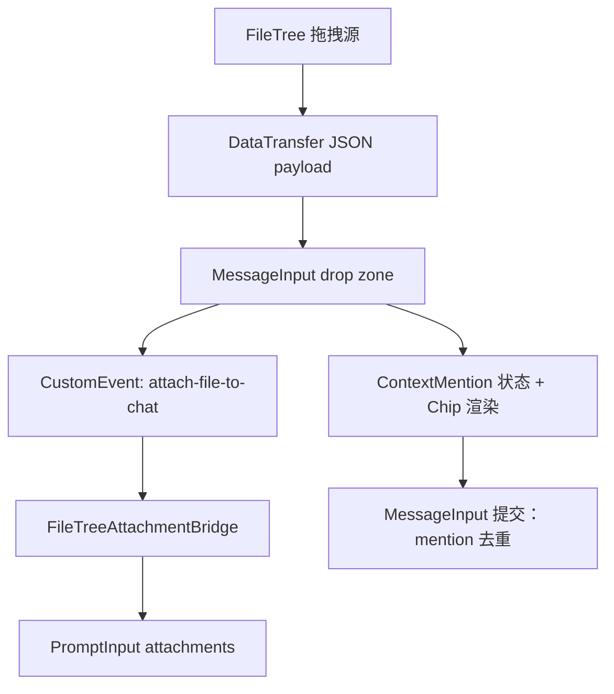

# 架构设计 (Architecture Specification)

> **功能名称：** 文件树拖拽生成 ContextMention（文件 + 目录）
> **版本：** v1.1
> **状态：** 审查中
> **关联需求：** `docs/specs/product.md`
> **最后更新：** 2026-03-05

---

## 1. 系统概览

本功能涉及 FileTree 与 MessageInput 的拖拽链路。FileTree 在拖拽开始时注入自定义 MIME payload，
MessageInput 作为 drop 目标解析 payload，文件拖拽触发附件桥接事件并添加 ContextMention，
目录拖拽仅添加 ContextMention。附件桥接失败时回退插入 `@path` 文本；发送前对 ContextMention
与输入文本的 `@path` 做去重。

### 架构决策记录 (ADR)

| 决策 | 选择方案 | 被否定方案 | 理由 |
|:---|:---|:---|:---|
| 拖拽数据格式 | 自定义 MIME + JSON payload | 仅使用 `text/plain` | 便于区分 FileTree 拖拽与外部拖拽 |
| 附件桥接方式 | `attach-file-to-chat` 事件 + `usePromptInputAttachments` | 直接在 MessageInput 内调用 PromptInput 私有 API | 保持与现有 FileTree “+” 入口一致 |
| 去重策略 | 发送前过滤已存在 `@path` | 发送时全部拼接 | 避免重复路径 |

---

## 2. 组件拓扑图

---

## 3. 数据模型

### 3.1 实体定义

#### ContextMention (前端内存态)

| 字段名 | 类型 | 约束 | 描述 |
|:---|:---|:---|:---|
| `id` | string | 唯一 | chip 标识 |
| `path` | string | 必填 | 绝对路径 |
| `name` | string | 必填 | 显示名称 |
| `type` | "file" \| "directory" | 必填 | chip 类型 |

#### FileTreeDragPayload (拖拽 payload)

| 字段名 | 类型 | 约束 | 描述 |
|:---|:---|:---|:---|
| `path` | string | 必填 | 节点路径 |
| `name` | string | 必填 | 节点名称 |
| `type` | "file" \| "directory" | 必填 | 节点类型 |

### 3.2 实体关系图

无持久化实体关系；仅在 MessageInput 内部维护数组状态。

---

## 4. API / 接口签名

### 4.1 复用既有 API

本迭代不新增 API 端点，仅复用：
- `GET /api/files/raw?path=...`（附件读取）
- 自定义事件 `attach-file-to-chat`

---

## 5. 依赖白名单

| 依赖名 | 版本 | 用途 | 是否新增 |
|:---|:---|:---|:---|
| — | — | 无新增依赖 | 否 |

---

## 6. 错误处理策略

| 错误场景 | 处理方式 | 用户感知 |
|:---|:---|:---|
| `/api/files/raw` 失败 | 触发 `onAttachFailed`，插入 `@path` 文本 | 输入框出现回退路径 |
| 拖拽 payload 解析失败 | 忽略 drop | 无感知 |

---

## 7. 安全策略

- **输入验证：** 仅处理 FileTree 自定义 MIME payload。
- **身份认证：** 沿用现有 API 权限。
- **数据访问控制：** 仍由 `/api/files/raw` 处理路径读取。
- **敏感数据处理：** 不新增 PII 处理。
- **审计日志：** 不新增。

---

## 8. 性能考量

| 指标 | 目标值 | 测量方式 |
|:---|:---|:---|
| 拖拽响应 | 交互无明显卡顿 | 手动交互验证 |
| 额外状态更新 | O(mention 数量) | 代码审查 |

---

## 9. 审批记录

| 日期 | 审批人 | 决定 | 备注 |
|:---|:---|:---|:---|
| 2026-03-05 | 待定 | 待修改 | 规范需更新以反映缺失的拖拽链路 |
